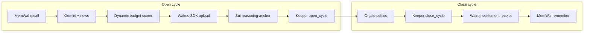

# openmind — Sui Overflow 2026

**The first prediction-market vault where the hedge policy thinks for itself, remembers every cycle, and proves every decision on-chain before the market settles.**

Three tracks, one codebase: **DeepBook Predict** (adaptive carry vault), **Walrus** (reasoning blobs + MemWal memory), **OpenZeppelin** (audited NAV math + access control).

Deadline: **June 29, 2026**

---

## Architecture



| Layer | Role |
|---|---|
| `contracts/` | Move vault, Predict adapter, reasoning anchor (OZ math) |
| `agent/` | Python reasoning: MemWal, GraphRAG, Gemini, Walrus via keeper CLI |
| `keeper/` | TypeScript executor: vault cycles, Walrus SDK, MemWal TS on close |
| `scripts/` | `verify:judge` submission pipeline |

**Per cycle:** recall past outcomes → score hedge budget → upload reasoning JSON to Walrus → anchor hash on Sui → open hedge on DeepBook Predict → wait for settlement → close → remember outcome in MemWal.

---

## Live testnet evidence (cycle 1)

Deployed package: `0x1d627374a7a393a9961324ac039927e029edf7f4f2c3cc6d98bcb4702a5e4dc7`

| Step | Tx |
|---|---|
| Vault open | [2KUkWwpWtPJzxCTrbFtxCUhTSPbeUmKBJCZfFiqTGhHS](https://suiscan.xyz/testnet/tx/2KUkWwpWtPJzxCTrbFtxCUhTSPbeUmKBJCZfFiqTGhHS) |
| Reasoning anchor | [Fb37ggDAyiFZqg8WJb74GNuMfRTZC8YdaKFZufDj7hGc](https://suiscan.xyz/testnet/tx/Fb37ggDAyiFZqg8WJb74GNuMfRTZC8YdaKFZufDj7hGc) |
| Vault close | [ud5HM2AU1hNdHYvVa7r9EcL5cyZs3WupicGLoSw99fC](https://suiscan.xyz/testnet/tx/ud5HM2AU1hNdHYvVa7r9EcL5cyZs3WupicGLoSw99fC) |

| Walrus | Blob ID |
|---|---|
| Reasoning JSON | `9kCEUsUwlDV6GRz3ItJe7QAvJvmU8_KGw8SXfO9U42U` |
| Settlement receipt | `j5KypANzV77uCO9Qe0XLAGsIy9wDcdxdijYQh76ofAw` |

**Outcome:** BTC settled above strike → hedge expired OTM. NAV ~49.99 dUSDC (from 50). MemWal stored outcome for future cycles.

Keeper: `0x0d786a55f9e2631bb9121d613fa36cdae52d6eab04236d808bb7eeec473424d9`  
Vault: `0x7d1717e1392bf6a9d4bb7a441c4709474f68e565ac96cede3c4ea651ecc12fee`

---

## Demo story (for judges)

1. **Deposit** dUSDC into the vault → receive omDUSDC shares.
2. **Open** — Agent recalls 5 past MemWal cycles, reads news via Gemini, scores a 250 bps hedge, uploads reasoning to Walrus (SDK only), anchors on Sui, keeper opens a downside put on DeepBook Predict.
3. **Wait** — Oracle runs ~85 minutes; no manual intervention.
4. **Close** — Keeper redeems PLP, uploads settlement receipt to Walrus, remembers outcome in MemWal.
5. **Verify** — `npm run verify:judge` replays historical oracles and compares fixed 250 bps vs dynamic AI budget across 3 PLP carry bands.

The vault does not promise returns. The hedge is sized per-cycle by an agent that learns from its own history.

---

## Quick start

```bash
# Contracts
cd contracts && sui move build -e testnet && sui move test -e testnet

# Keeper
cd keeper && bun install   # or npm install

# Agent (Python 3.12+)
cd agent && python3.12 -m venv .venv && .venv/bin/pip install -r requirements.txt

# Full submission check
npm run verify:judge
```

Expected markers:

```
OPENMIND_CONTRACTS_VALID
OPENMIND_RECEIPTS_VALID
OPENMIND_SIMULATION_VALID
OPENMIND_PUBLIC_SURFACE_VALID
OPENMIND_NARRATIVE_VALID
OPENMIND_SUBMISSION_VALID
```

---

## Env vars

Copy `deploy/testnet.env` after deploy. Agent secrets in `agent/.env` (gitignored).

```
# deploy/testnet.env
OPENMIND_PACKAGE=
VAULT_OBJECT=
VAULT_MANAGER=
ACCESS_CONTROL_OBJECT=
SUI_KEEPER_KEY=
SUI_KEEPER_ADDRESS=

# agent/.env
GEMINI_API_KEY=              # primary LLM (gemini-2.5-flash)
GEMINI_MODEL=gemini-2.5-flash
MEMWAL_ACCOUNT_ID=
MEMWAL_PRIVATE_KEY=
MEMWAL_SERVER_URL=https://relayer.memory.walrus.xyz
TAVILY_API_KEY=              # optional; richer news vs Gemini search
GRAPHRAG_ENABLED=true
```

---

## Keeper commands

```bash
cd keeper
npm run vault:status
npm run vault:open
npm run vault:close
npm run vault:roll          # close if settled, then open next
npm run sim:capture         # snapshot settled oracle states
npm run sim:vault           # fixed vs dynamic simulation
```

---

## verify:judge

```bash
npm run verify:judge
```

Runs: contracts → live fill receipts → simulation (capture + replay) → public API health → narrative lint → submission artifact gate.

Simulation output: `web/public/sim/vault_sim.json`

---

## References

Full spec: `openmind_deepbook_prd (2).md`

- [DeepBook Predict](https://docs.sui.io/onchain-finance/deepbook-predict/)
- [Walrus TypeScript SDK](https://sdk.mystenlabs.com/walrus)
- [MemWal Python SDK](https://docs.wal.app/walrus-memory/python-sdk/quick-start)
- [OpenZeppelin Contracts for Sui](https://docs.openzeppelin.com/contracts-sui/1.x)
