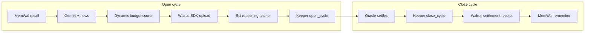

# openmind — Sui Overflow 2026

**The first prediction-market vault where the hedge policy thinks for itself, remembers every cycle, and proves every decision on-chain before the market settles.**

Four tracks, one codebase: **DeepBook Predict** (adaptive carry vault), **Walrus** (reasoning blobs + MemWal memory), **OpenZeppelin** (audited NAV math + access control), **Agentic Web sub-track 2** (revocable, budget-capped autonomous agent wallet).

Deadline: **June 29, 2026**

Live demo: [open-mind-sui.vercel.app](https://open-mind-sui.vercel.app/)

---

## Architecture



| Layer | Role |
|---|---|
| `contracts/` | Move vault, Predict adapter, reasoning anchor (OZ math) |
| `agent/` | Python reasoning: MemWal, GraphRAG, Gemini, Walrus via keeper CLI |
| `keeper/` | TypeScript executor: vault cycles, Walrus SDK, MemWal TS on close |
| `scripts/` | `verify:judge` submission pipeline |

**Per cycle:** recall past outcomes → score hedge budget → upload reasoning JSON to Walrus → anchor hash on Sui → open hedge on DeepBook Predict → wait for settlement → close → remember outcome in MemWal.

---

## Live testnet evidence (current package, triggered via the /brain "Run cycle" button)

Deployed package: `0x3538ab0c8317477f23d1c53603a2d402bccf2f53fee8e52f9af1670bc6f3c17a`

| Step | Tx |
|---|---|
| Vault close (previous cycle, settled OTM) | [321xzKYNpGT9GZDniairhwoB1ZzKnJNAhifqKR2vzVt3](https://suiscan.xyz/testnet/tx/321xzKYNpGT9GZDniairhwoB1ZzKnJNAhifqKR2vzVt3) |
| Reasoning anchor | [4pBhWupNrn4VzNChYcFEVrixM6HTjw6MDUBmE1hhw1wu](https://suiscan.xyz/testnet/tx/4pBhWupNrn4VzNChYcFEVrixM6HTjw6MDUBmE1hhw1wu) |
| Vault open (agent_cap-gated) | [Unmyix5KW1Jzqk1QXsnoevDExoR7ip9BomZwNCWAH1F](https://suiscan.xyz/testnet/tx/Unmyix5KW1Jzqk1QXsnoevDExoR7ip9BomZwNCWAH1F) |

| Walrus | Blob ID |
|---|---|
| Reasoning JSON | `PHlx0Opx6oL2xOEWoolEwgeM9VX1OfnUnE_Mu6nZK6g` |

**AgentCap after this cycle:** `spent` and `action_count` both incremented on-chain (queryable live at `/api/agent-cap/state` or the `/wallet` page) — the budget/expiry/revocation gate is real, not advisory.

Vault: `0x5c7f075330ca60e6b3d68354baea80a624da25a6dbc771537994a00be9ca3f08`  
AgentCap (shared): `0x188a12ac96e6017e97b7b0f7a811e21d8e773eef726cce1a8fdad9c70049c4b1` — re-granted via `node scripts/grant-agent-cap.mjs` when the previous cap's 24h window lapsed; see that script to redelegate again.

---

Demo walkthrough for judges: see [DEMO.md](DEMO.md).

---

## Quick start

```bash
# Contracts
cd contracts && sui move build -e testnet && sui move test -e testnet

# Keeper
cd keeper && bun install   # or npm install

# Agent (Python 3.12+)
cd agent && python3.12 -m venv .venv && .venv/bin/pip install -r requirements.txt

# Full submission check
npm run verify:judge
```

Expected markers:

```
OPENMIND_CONTRACTS_VALID
OPENMIND_RECEIPTS_VALID
OPENMIND_SIMULATION_VALID
OPENMIND_PUBLIC_SURFACE_VALID
OPENMIND_NARRATIVE_VALID
OPENMIND_SUBMISSION_VALID
```

---

## Env vars

Copy `deploy/testnet.env` after deploy. Agent secrets in `agent/.env` (gitignored).

```
# deploy/testnet.env
OPENMIND_PACKAGE=
VAULT_OBJECT=
VAULT_MANAGER=
ACCESS_CONTROL_OBJECT=
SUI_KEEPER_KEY=
SUI_KEEPER_ADDRESS=

# agent/.env
GEMINI_API_KEY=              # primary LLM (gemini-2.5-flash)
GEMINI_MODEL=gemini-2.5-flash
MEMWAL_ACCOUNT_ID=
MEMWAL_PRIVATE_KEY=
MEMWAL_SERVER_URL=https://relayer.memory.walrus.xyz
TAVILY_API_KEY=              # optional; richer news vs Gemini search
GRAPHRAG_ENABLED=true
```

---

## Keeper commands

```bash
cd keeper
npm run vault:status
npm run vault:open
npm run vault:close
npm run vault:roll          # close if settled, then open next
npm run sim:capture         # snapshot settled oracle states
npm run sim:vault           # fixed vs dynamic simulation
```

---

## verify:judge

```bash
npm run verify:judge
```

Runs: contracts → live fill receipts → simulation (capture + replay) → public API health → narrative lint → submission artifact gate.

Simulation output: `web/public/sim/vault_sim.json`

---

## References

Full spec: `openmind_deepbook_prd (2).md`

- [DeepBook Predict](https://docs.sui.io/onchain-finance/deepbook-predict/)
- [Walrus TypeScript SDK](https://sdk.mystenlabs.com/walrus)
- [MemWal Python SDK](https://docs.wal.app/walrus-memory/python-sdk/quick-start)
- [OpenZeppelin Contracts for Sui](https://docs.openzeppelin.com/contracts-sui/1.x)
